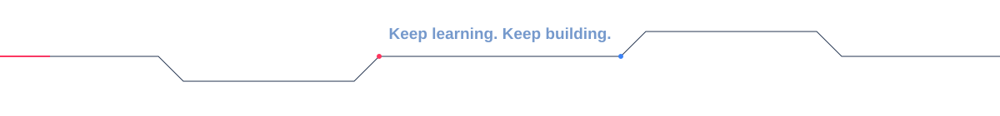

<table width="100%"><tr><td>

 

### About Me

A curious developer who enjoys turning ideas into things people can use — from full-stack apps to IoT experiments and whatever sparks the next “what if?”

- Currently working on **Batchmate** — a macOS-based University batch management app
- Looking to collaborate on **creative, ambitious project ideas** — full-stack, IoT, open source, or something I haven't tried yet. If it's exciting, I'm in.
- Currently learning **TypeScript** and modern **React** patterns
- Fun fact: I started my first year learning to code and ended up helping build a **hologram fan array**. Curiosity took the scenic route.

<a href="#top">⬆ Back to top</a>

### Connect With Me

  
  
  
  
  

  

<a href="#top">⬆ Back to top</a>

### Tech Stack

  

Click the badge to open skillicons.dev.

                         

<a href="#top">⬆ Back to top</a>

### GitHub Stats

  
  

  

  
  

<a href="#top">⬆ Back to top</a>

### Contribution Snake

  <picture>
    <source media="(prefers-color-scheme: dark)" srcset="https://raw.githubusercontent.com/Nezz77/Nezz77/output/github-contribution-grid-snake-dark.svg" />
    
  </picture>

<a href="#top">⬆ Back to top</a>

### Words I Build By

<i>"The only way to do great work is to love what you do."</i>
 
— Steve Jobs

### Support My Work

FutureTech|NH

</td></tr></table>
